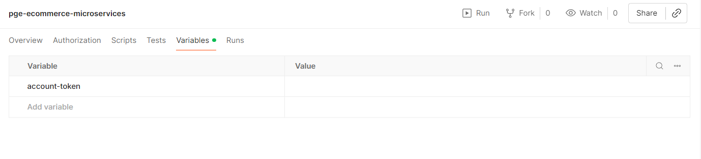
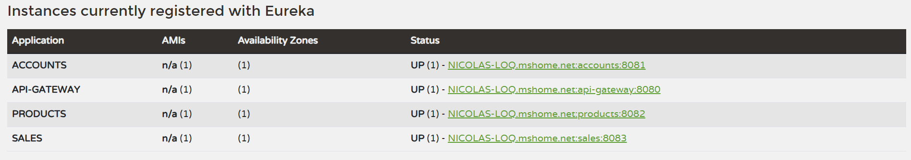

# ecommerce-pge-backend

Backend de e-commerce construído com arquitetura de microsserviços em Spring Boot para o desafio técnico da PGE.

## Serviços

| Serviço | Porta | Responsabilidade |
|---|---|---|
| `eureka-service` | 8761 | Service discovery |
| `accounts` | 8081 | Autenticação de usuários e emissão de JWTs |
| `products` | 8082 | Catálogo de produtos (CRUD) |
| `sales` | 8083 | Registro e consulta de vendas |
| `api-gateway` | 8080 | Orquestração e roteamento dos microsserviços |

---

## Como Subir o Projeto

### Requisitos de Ambiente
  
Para executar este projeto, você precisará ter instalado em seu ambiente:
- Java 21 ou superior
- Maven 3.9 ou superior

Certifique-se de que as variáveis de ambiente estão configuradas corretamente antes de executar o projeto.

---

Cada serviço deve ser subido individualmente e na ordem abaixo, para o registro e disponibilização corretos de cada microsserviço no Eureka Server, e para que o API Gateway consuma corretamente o mesmo:

1. eureka-service
2. accounts
3. products
4. sales
5. api-gateway

Para executar cada aplicação, abra um terminal separado, e execute os seguintes comandos na pasta raiz do projeto:

``` bash
cd eureka-service
./mvnw spring-boot:run
```
``` bash
cd accounts
./mvnw spring-boot:run
```
``` bash
cd products
./mvnw spring-boot:run
```
``` bash
cd sales
./mvnw spring-boot:run
```
``` bash
cd api-gateway
./mvnw spring-boot:run
```

---

## Postman

Dentro do projeto, no caminho abaixo, é possível encontrar uma collection do Postman, que poderá ser importada para consumo dos microsserviços:

```
\ecommerce-pge-backend\postman\pge-ecommerce-microservices.postman_collection.json
```

## Obtendo o Token JWT

O serviço de accounts já possui um usuário administrador criado automaticamente pela migration do Flyway.

**Credenciais do usuário padrão:**
- Email: `admin@ecommerce.com`
- Senha: `admin123`

### Requisição de login

```http
POST http://localhost:8080/accounts/api/accounts/login
Content-Type: application/json

{
  "email": "admin@ecommerce.com",
  "password": "admin123"
}
```

### Resposta

```json
{
  "token": "eyJhbGciOiJIUzI1NiJ9...",
  "email": "admin@ecommerce.com"
}
```

Use o valor de `token` no header `Authorization: Bearer <token>` em todas as requisições protegidas.

o valor do token pode ser inserido na variável `account-token` na Collection do Postman, para autenticar todos os endpoints que necessitam.



---

## Endpoints

> Todas as requisições devem ser feitas para o **API Gateway na porta 8080**.
> Rotas protegidas exigem o header `Authorization: Bearer <token>`.

### Accounts

| Método | Rota | Autenticação | Descrição |
|---|---|---|---|
| POST | `accounts/api/accounts/login` | Não | Autentica e retorna o JWT |
| POST | `accounts/api/accounts/register` | Sim | Cria um novo usuário |

#### Registrar usuário

```http
POST http://localhost:8080/accounts/api/accounts/register
Content-Type: application/json

{
  "email": "joao@email.com",
  "password": "senha123",
  "address": "Rua das Flores, 123",
}
```

---

### Products

| Método | Rota | Autenticação | Descrição |
|---|---|---|---|
| POST | `products/api/products` | Sim | Cria um produto |
| GET | `products/api/products` | Sim | Lista todos os produtos |
| GET | `products/api/products/{id}` | Sim | Busca produto por ID |
| PUT | `products/api/products/{id}` | Sim | Atualiza produto |
| DELETE | `products/api/products/{id}` | Sim | Remove produto |

#### Criar produto

```http
POST http://localhost:8080/products/api/products
Authorization: Bearer <token>
Content-Type: application/json

{
  "description": "Notebook Dell Inspiron 15",
  "category": "Computadores",
  "price": 3499.90
}
```

#### Listar produtos

```http
GET http://localhost:8080/products/api/products
Authorization: Bearer <token>
```

---

### Sales

| Método | Rota | Autenticação | Descrição |
|---|---|---|---|
| POST | `sales/api/sales` | Sim | Registra uma venda |
| GET | `sales/api/sales` | Sim | Lista vendas do usuário autenticado |

#### Registrar venda

```http
POST http://localhost:8080/sales/api/sales
Authorization: Bearer <token>
Content-Type: application/json

{
  "productId": 1,
  "quantity": 2
}
```

**Resposta:**

```json
{
  "id": 1,
  "userEmail": "admin@ecommerce.com",
  "productId": 1,
  "quantity": 2,
  "unitPrice": 199.00,
  "totalPrice": 398.00,
  "saleDate": "2026-03-03T09:55:36.329092"
}
```

#### Listar vendas

```http
GET localhost:8080/sales/api/sales
Authorization: Bearer <token>
```

Retorna apenas as vendas do usuário identificado no token.

---

## Eureka Dashboard

Após subir os serviços, o dashboard do Eureka fica disponível em:

```
http://localhost:8761
```

Todos os serviços devem aparecer com status **UP**.

